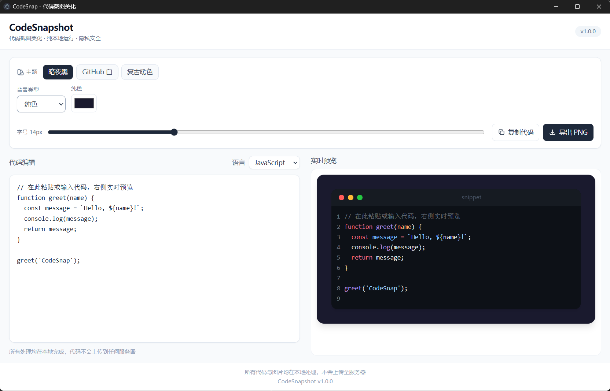
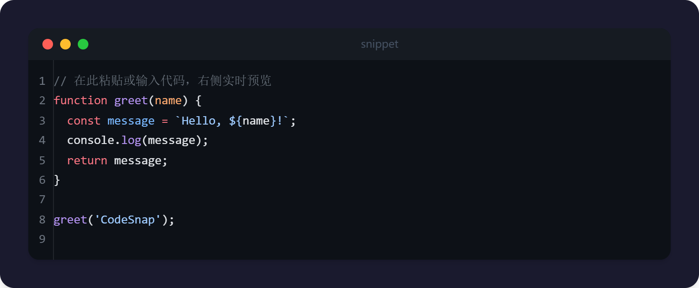

<div align="center">

# Code Screenshot Beautification Tool

### 代码截图美化工具 · CodeSnapshot

一个极简、现代、高颜值且**完全免费**的在线代码截图生成工具。

[](https://github.com/szxyes77/Code-screenshot-beautification-tool/stargazers)
[](LICENSE)
[](https://github.com/szxyes77/Code-screenshot-beautification-tool/releases)
[](https://vitejs.dev/)
[](https://react.dev/)
[](https://www.electronjs.org/)

[在线体验](https://szxyes77.github.io/Code-screenshot-beautification-tool/) · [下载桌面版](https://github.com/szxyes77/Code-screenshot-beautification-tool/releases) · [报告问题](https://github.com/szxyes77/Code-screenshot-beautification-tool/issues)

</div>

---

## 简介

**Code Screenshot Beautification Tool**（CodeSnapshot）可以帮助开发者快速创建带有**语法高亮**、**窗口装饰**（macOS 风格）和**精美背景**的代码图片。

无论你是想在博客、社交媒体分享代码，还是为演示文稿准备素材，这款工具都能**一键生成**专业级代码截图。

> 🔒 **隐私至上** — 数据完全在浏览器本地处理，代码**绝不会**上传到任何服务器。

---

## 截图展示

### 工具界面



*左右分栏：代码编辑 + 实时预览，支持主题切换与一键导出*

### 导出效果

<!-- 请添加实际截图文件：screenshot-export.png -->



*导出后的高清 PNG 代码卡片效果*

---

## 核心特性

| | 特性 | 说明 |
|:---:|:---|:---|
| 🚀 | **极速响应** | 基于 Vite + React + Tailwind CSS，交互流畅、加载迅速 |
| 🌈 | **精准高亮** | 使用与 VS Code 同引擎的 **Shiki** 进行语法高亮 |
| 🎨 | **多彩主题** | 内置暗夜黑、GitHub 白、复古暖色等多套精美主题 |
| 🖥️ | **窗口装饰** | 模拟 macOS 红黄绿窗口控制按钮，真实感十足 |
| 🖼️ | **多种背景** | 支持纯色、CSS 渐变或自定义图片 URL 背景 |
| 📸 | **一键导出** | 使用 html-to-image 将代码卡片导出为高清 PNG |
| 📋 | **一键复制** | 快速复制你编写的原始代码内容 |
| 🔒 | **隐私至上** | 全部在本地处理，代码不上传服务器 |
| 📦 | **桌面应用** | 提供 Windows `.exe`，可离线使用 |

---

## 在线演示

<<<<<<< 
🌐 **立即体验：** **([https://code-screenshot-beautification-tool.vercel.app/](https://szxyes77.github.io/Code-screenshot-beautification-tool/)**
>>>>>>> 

在浏览器中打开即可使用，无需安装。

---

## 桌面版下载

前往 **[GitHub Releases](https://github.com/szxyes77/Code-screenshot-beautification-tool/releases)** 下载最新桌面版：

| 文件 | 说明 |
|------|------|
| `CodeSnapshot-1.0.0-portable.exe` | 🎒 免安装便携版，双击即用 |
| `CodeSnapshot-1.0.0-setup.exe` | 📥 NSIS 安装版，可选安装目录与桌面快捷方式 |

---

## 本地运行与开发

### 环境要求

| 依赖 | 版本 |
|------|------|
| Node.js | >= 18 |
| npm | >= 9 |

### 1. 克隆仓库

```bash
git clone https://github.com/szxyes77/Code-screenshot-beautification-tool.git
cd Code-screenshot-beautification-tool
```

### 2. 安装依赖

```bash
npm install
```

### 3. 启动 Web 开发服务器

```bash
npm run dev
```

浏览器访问 **http://localhost:5173**

### 4. 启动 Electron 桌面开发模式

```bash
npm run electron:dev
```

将同时启动 Vite 与 Electron 窗口（1200×800）。

### 常用命令

| 命令 | 说明 |
|------|------|
| `npm run dev` | Web 开发模式 |
| `npm run build` | 构建前端至 `dist/` |
| `npm run preview` | 预览生产构建 |
| `npm run electron:dev` | Electron 桌面开发 |
| `npm run electron:build` | 打包 Windows 桌面应用 |
| `npm run analyze` | 打包体积分析 |

---

## 打包为桌面应用

```bash
npm run electron:build
```

构建完成后，产物输出至 **`dist-electron/`** 目录：

```
dist-electron/
├── CodeSnapshot-1.0.0-portable.exe   # 便携版
├── CodeSnapshot-1.0.0-setup.exe      # 安装版
└── win-unpacked/                     # 未打包目录
```

自定义图标：将 `icon.ico` 放入 `build/` 目录后重新打包，详见 [`build/README.md`](./build/README.md)。

---

## 技术栈

```
React 18  +  Vite 6  +  Tailwind CSS 3
        ↓
    Shiki 3（语法高亮）
        ↓
  html-to-image（PNG 导出）
        ↓
  Electron 35 + electron-builder（桌面版）
```

| 库 | 用途 |
|----|------|
| [React](https://react.dev/) | UI 组件与状态管理 |
| [Vite](https://vitejs.dev/) | 开发与生产构建 |
| [Tailwind CSS](https://tailwindcss.com/) | 样式与响应式布局 |
| [Shiki](https://shiki.style/) | VS Code 级语法高亮 |
| [html-to-image](https://github.com/bubkoo/html-to-image) | DOM 转 PNG，与预览一致 |
| [Electron](https://www.electronjs.org/) | 跨平台桌面壳 |
| [electron-builder](https://www.electron.build/) | 打包 `.exe` 安装包 |

---

## 未来计划

- [ ] 更多主题与自定义配色
- [ ] 支持导出 SVG / JPEG
- [ ] 可调内边距、圆角与阴影
- [ ] macOS / Linux 桌面安装包
- [ ] 界面多语言（中 / 英）

---

## 许可证

本项目基于 **[MIT License](LICENSE)** 开源，可自由使用、修改与分发。

---

## 致谢

设计灵感来自优秀的代码截图工具：

- [Carbon](https://carbon.now.sh/)
- [Ray.so](https://ray.so/)

感谢 [Shiki](https://shiki.style/)、[Vite](https://vitejs.dev/) 等开源社区。

---

<div align="center">

**如果这个项目对你有帮助，欢迎点个 ⭐ Star！**

[GitHub 仓库](https://github.com/szxyes77/Code-screenshot-beautification-tool) · [在线演示](https://xiangmu2.vercel.app) · [下载 Releases](https://github.com/szxyes77/Code-screenshot-beautification-tool/releases)

<br />

<sub>Made with ❤️ for developers who love beautiful code</sub>

</div>
